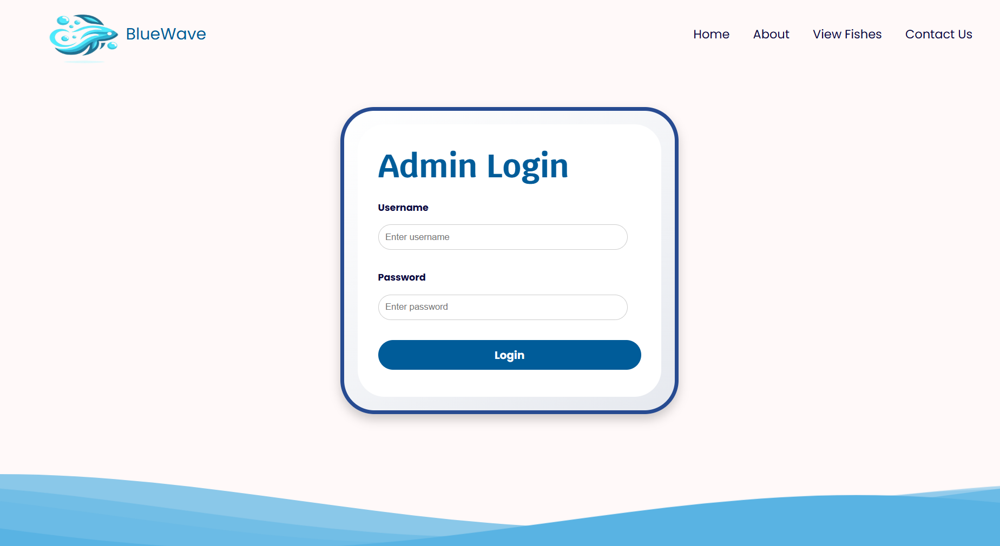
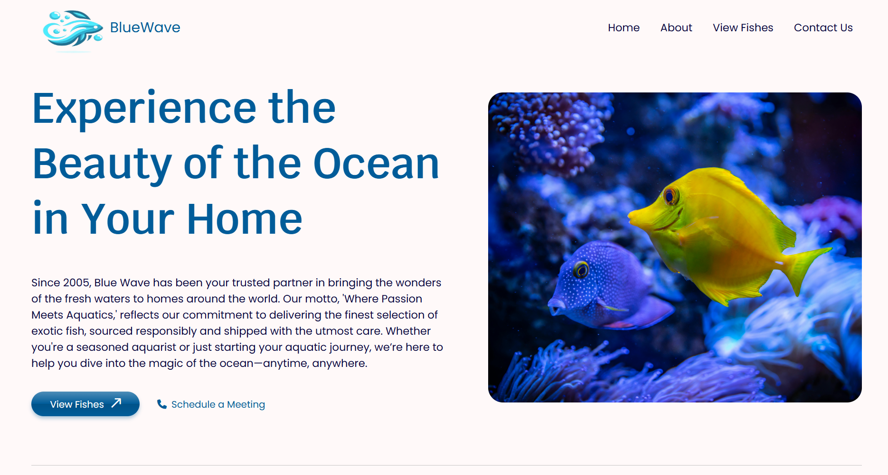
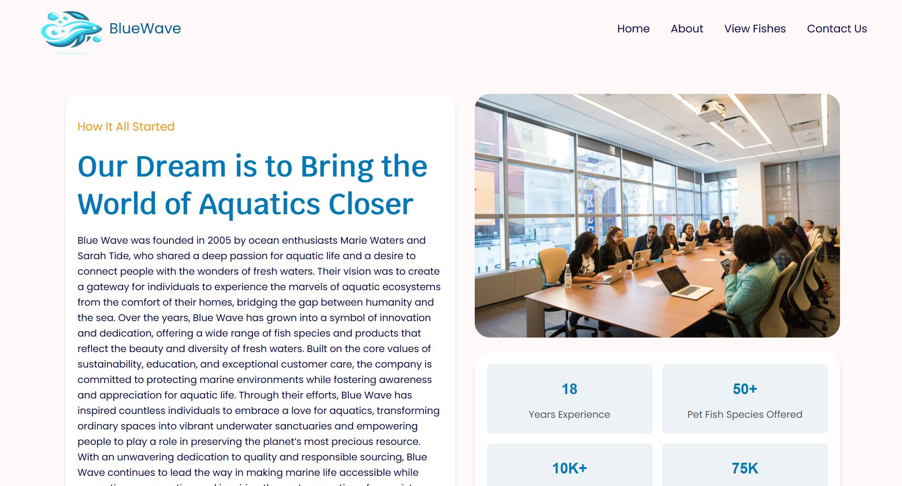
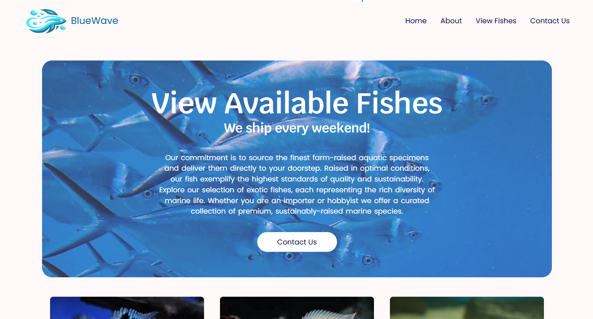
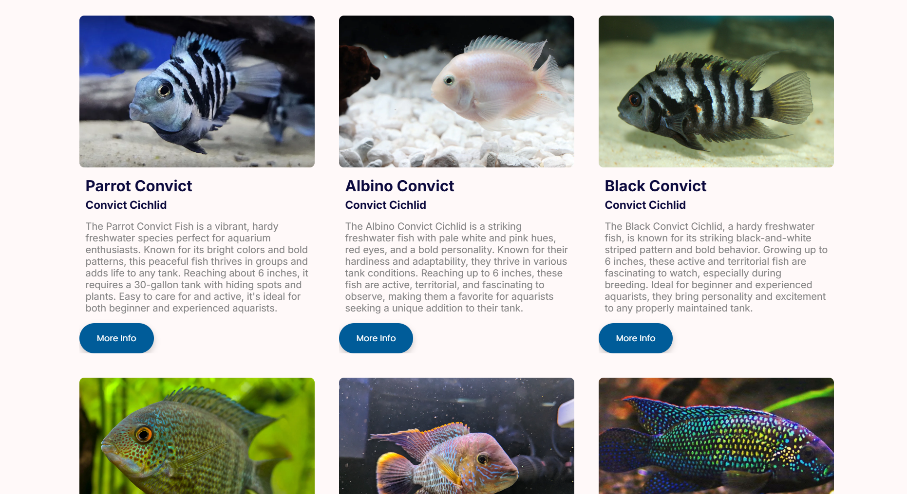
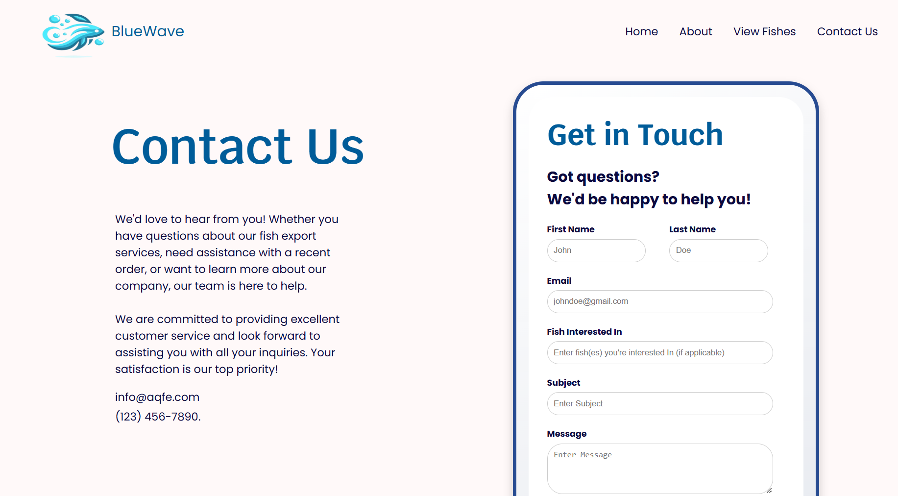

# Flask Fish Store Project

This is a Flask web application for managing a fish store. Customers can browse available fishes, while admins can manage them through the dashboard.

---

## Features
- View fish catalog with images, descriptions, and details.
- Admin dashboard with "Add Fish" functionality.
- Dynamic data fetching using PostgreSQL.
- Responsive UI with modern design.

---

## Prerequisites

Before running the project, ensure the following are installed:

- **Python 3.8 or above**
- **PostgreSQL**
- **pip** (Python package installer)
- **Virtualenv** (optional, but recommended)

---

## How to Run

### 1. Clone the Repository
Clone the project repository and navigate to its directory:
`git clone <repository-url>`
`cd <repository-folder>`

### 2. Create Virtual Environment
`python3 -m venv venv`
`source venv/bin/activate`   # On Windows: `venv\Scripts\activate`

### 3. Install Requirements
`pip install -r requirements.txt`

### 4. Set up Database

`CREATE DATABASE your_database_name;`
`DATABASE_URL=postgresql://<username>:<password>@localhost:5432/your_database_name`

To Access the Admin Dashboard
Visit the /admin/dashboard route for admin-specific features.

## Pages
A preview of a few pages.

